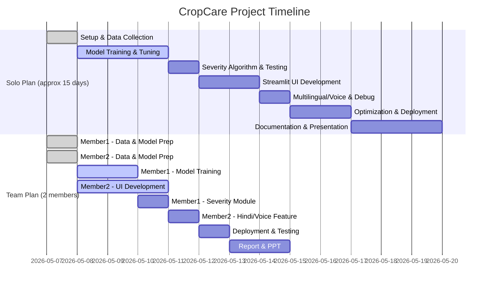

# Executive Summary

We will build **CropCare** – a lightweight crop disease detector using **MobileNetV2** and **Streamlit**, deployable on free tiers (HuggingFace Spaces). The project uses the *PlantVillage* dataset (54K+ leaf images from 14 crops【13†L252-L260】) and includes disease classification plus severity estimation via HSV-based segmentation【18†L553-L562】. The plan covers data prep/augmentation, transfer-learning training (with ~10 epochs, Adam, augmentations【42†L119-L122】), then model optimization (TFLite quantization ≈4× size reduction【46†L192-L199】). We add features (Hindi labels, voice output) and finalize with testing, CI-friendly repo, and detailed documentation.  

## 1. Requirements

- **Hardware:** Any modern laptop (e.g. 8GB RAM, Core i3/i5 or Ryzen 3/5, ~50GB disk). No GPU required (training ~30–120 min on CPU). Optional GPU/Colab for speed.  
- **Software:** Windows/Linux/Mac with:
  - [Python](https://www.python.org/) 3.9+ 
  - Code editor (e.g. VSCode) + Git (for repo).  
  - (Optional) Google Colab or Kaggle notebook for faster training.  
- **Libraries (Python packages):** Latest stable or recent versions, e.g.:  
  ```
  Python>=3.9
  TensorFlow 2.x (e.g. 2.11 or later)【32†L531-L537】  
  OpenCV-Python >=4.5
  numpy >=1.19
  Pillow >=8.0
  matplotlib >=3.3
  scikit-learn >=0.24
  streamlit >=1.2
  gTTS >=2.2 (text-to-speech)
  pyttsx3 >=2.90 (offline TTS)
  ```
- **Free Tools:**  
  - [Hugging Face Spaces](https://huggingface.co/spaces) (Streamlit SDK) – free tier gives 16GB RAM/50GB disk【22†L181-L189】.  
  - [Streamlit Community Cloud](https://streamlit.io/cloud) as alternative.  
  - All above libraries are open-source (no cost).

## 2. Data Collection & Preparation

- **Dataset:** Use [PlantVillage Dataset](https://www.kaggle.com/mohitsingh1804/plantvillage) (~54,305 images【13†L252-L260】) covering 14 crops, 38 disease/healthy classes.  
- **Selected Classes:** For ease, start with a few crops (e.g. Tomato, Potato) and 3–5 classes (e.g. *Tomato-Early Blight, Tomato-Late Blight, Tomato-Healthy, Potato-Late Blight*) plus “healthy” classes.  
- **Structure:** Arrange `dataset/` as:  
  ```
  dataset/
    Tomato_Early_Blight/
    Tomato_Late_Blight/
    Tomato_Healthy/
    Potato_Late_Blight/
    ... (other classes)
  ```  
  Each subfolder contains JPEG leaf images (download from PlantVillage or Kaggle). Ensure **balanced** class counts if possible.

- **Cleaning:** Manually inspect and remove badly labeled or empty images. Resize images to a uniform size (e.g. 224×224 or 128×128 pixels).  

- **Augmentation:** Use `ImageDataGenerator` for on-the-fly augmentation: e.g. random rotations, flips, zoom, shear (to increase variety). This improves generalization.  

- **Dataset Split:** Use `ImageDataGenerator(validation_split=0.2)` to split ~80% train, 20% val.

## 3. Folder Structure

Organize project files as follows (example):

```
CropCare/                   # Root folder for repo
├── dataset/                # Subfolders per disease class (images)
├── model/                  # To save trained models (e.g. .h5, .tflite)
├── src/
│   ├── train.py            # Script to train the CNN model
│   ├── predict.py          # Script to run inference on test images
│   ├── severity.py         # (Optional) functions for severity estimation
│   ├── utils.py            # Helper functions (load image, preprocess etc.)
│   └── app.py              # Streamlit application
├── requirements.txt        # pip dependencies for CI/deployment
├── README.md               # Project overview and instructions
├── report/                 # Project documentation (synopsis, PPT)
│   ├── report.docx
│   └── presentation.pptx
└── .gitignore              # Ignore dataset, model files if not in repo
```

Example `requirements.txt` (CI-friendly pinned versions):

```
numpy>=1.19
pillow>=8.0
tensorflow>=2.9
opencv-python>=4.5
matplotlib>=3.3
scikit-learn>=0.24
streamlit>=1.2
gTTS>=2.2
pyttsx3>=2.90
```

Include `pip install -r requirements.txt` instructions in README.

## 4. Training Pipeline (MobileNetV2)

Use **transfer learning** with MobileNetV2 (pretrained on ImageNet) for our classification task. This speeds up training and leverages learned features.

```python
import tensorflow as tf
from tensorflow.keras.preprocessing.image import ImageDataGenerator
from tensorflow.keras.models import Model
from tensorflow.keras.layers import Dense, GlobalAveragePooling2D
from tensorflow.keras.optimizers import Adam
from tensorflow.keras.callbacks import ModelCheckpoint, EarlyStopping

# Paths
train_dir = "dataset/"
IMG_SIZE = (224, 224)  # or (128,128) for smaller model
BATCH_SIZE = 32

# Data generators with augmentation
train_datagen = ImageDataGenerator(rescale=1./255,
                                   rotation_range=20,
                                   width_shift_range=0.2,
                                   height_shift_range=0.2,
                                   zoom_range=0.2,
                                   horizontal_flip=True,
                                   validation_split=0.2)

train_gen = train_datagen.flow_from_directory(train_dir,
                                              target_size=IMG_SIZE,
                                              batch_size=BATCH_SIZE,
                                              class_mode='categorical',
                                              subset='training')
val_gen = train_datagen.flow_from_directory(train_dir,
                                            target_size=IMG_SIZE,
                                            batch_size=BATCH_SIZE,
                                            class_mode='categorical',
                                            subset='validation')
num_classes = train_gen.num_classes

# Load MobileNetV2 base
base_model = tf.keras.applications.MobileNetV2(include_top=False,
                                               weights='imagenet',
                                               input_shape=(*IMG_SIZE, 3))
base_model.trainable = False  # freeze base

# Add custom top layers
x = GlobalAveragePooling2D()(base_model.output)
x = tf.keras.layers.Dropout(0.2)(x)
outputs = Dense(num_classes, activation='softmax')(x)
model = Model(inputs=base_model.input, outputs=outputs)

# Compile
model.compile(optimizer=Adam(learning_rate=0.001),
              loss='categorical_crossentropy',
              metrics=['accuracy'])
```

**Hyperparameters:**  
- *Epochs:* ~10–15 (monitor for overfitting). [42†L119-L122] reports 10 epochs with augmentation.  
- *Batch size:* 16–32.  
- *Learning rate:* 0.001 (tune if needed).  
- *Optimizer:* Adam (default)【42†L119-L122】.  
- *Callbacks:* Use `EarlyStopping` (patience=3) and `ModelCheckpoint` to save best model.

Train:
```python
checkpoint = ModelCheckpoint('model/cropcare_mobilenet.h5', save_best_only=True)
early_stop = EarlyStopping(patience=3, restore_best_weights=True)

history = model.fit(train_gen,
                    validation_data=val_gen,
                    epochs=12,
                    callbacks=[checkpoint, early_stop])
```
*(Expected training time:* on a mid-range laptop, ~30–120 minutes; on Colab GPU <30 min.)

**Expected Accuracy:** Prior work achieved ~97–98% on PlantVillage【32†L531-L537】. With fewer classes and augmentations, ~90–96% is realistic. Monitor training/val accuracy and plot loss curves with `matplotlib` after training.

## 5. Severity Estimation (Affected Area %)

Implement a simple computer vision step to estimate disease severity (infected area %) per leaf:

1. **Preprocess Leaf Image:** After resizing, isolate the leaf:
   ```python
   import cv2
   img = cv2.imread("leaf.jpg")
   hsv = cv2.cvtColor(img, cv2.COLOR_BGR2HSV)
   ```
2. **HSV Thresholding:** Define HSV range for typical diseased colors (brown/black spots) vs healthy green. For example:
   ```python
   lower = (10, 50, 50)   # tune these values
   upper = (179, 255, 255)
   mask = cv2.inRange(hsv, lower, upper)
   ```
   Adjust `lower`/`upper` to capture brown/black diseased regions【18†L553-L562】.  

3. **Morphological Processing:** Remove noise:
   ```python
   kernel = cv2.getStructuringElement(cv2.MORPH_ELLIPSE, (5,5))
   mask = cv2.morphologyEx(mask, cv2.MORPH_CLOSE, kernel)
   mask = cv2.morphologyEx(mask, cv2.MORPH_OPEN, kernel)
   ```
   This closes small holes and removes specks【18†L553-L562】.

4. **Contour Detection:** Find infected region area:
   ```python
   contours, _ = cv2.findContours(mask, cv2.RETR_EXTERNAL, cv2.CHAIN_APPROX_SIMPLE)
   diseased_area = sum(cv2.contourArea(c) for c in contours)
   ```
   
5. **Leaf Area:** Estimate total leaf area (e.g. using `cv2.inRange` on green or largest contour):
   ```python
   # Option: mask for green leaves, or simply use largest contour of original leaf
   leaf_mask = cv2.inRange(hsv, (25, 40, 40), (85, 255, 255)) 
   leaf_mask = cv2.morphologyEx(leaf_mask, cv2.MORPH_CLOSE, kernel)
   leaf_contours, _ = cv2.findContours(leaf_mask, cv2.RETR_EXTERNAL, cv2.CHAIN_APPROX_SIMPLE)
   leaf_area = max(cv2.contourArea(c) for c in leaf_contours)
   ```
6. **Compute Severity:** `severity_pct = (diseased_area / leaf_area) * 100`【18†L553-L562】.  
   Assign a category (e.g. Mild <20%, Medium 20–50%, Severe >50%).

This HSV-contour approach quantifies how much of the leaf is affected【18†L553-L562】. It will have errors (lighting/shadows can appear as disease) but gives a useful "severity" feature for users.

## 6. Multilingual & Voice Output

- **Hindi Support:** Maintain a dictionary mapping each English disease label to Hindi. E.g.:
  ```python
  hindi_names = {
      "Tomato Early Blight": "टमाटर अर्ली ब्लाइट",
      "Tomato Late Blight": "टमाटर लेट ब्लाइट",
      "Potato Late Blight": "आलू लेट ब्लाइट",
      # ... etc.
  }
  ```
  Display both English and Hindi in Streamlit:  
  ```python
  st.write("Disease (रोग):", english_label, "/", hindi_names.get(english_label, ""))
  ```
- **Voice Output:** Use Python TTS to speak results. Two options:
  - **pyttsx3 (offline):**
    ```python
    import pyttsx3
    engine = pyttsx3.init()
    engine.say(f"Disease detected: {english_label}")
    engine.say(f" गंभीरता: {severity_pct:.0f} प्रतिशत")
    engine.runAndWait()
    ```
  - **gTTS (Google TTS, requires internet):**
    ```python
    from gtts import gTTS
    tts = gTTS(text=f"Disease detected: {english_label}", lang='en')
    tts.save("audio.mp3")
    st.audio("audio.mp3", format='audio/mp3')
    ```
  In Streamlit, you can embed audio with `st.audio()` or use `pyttsx3` to speak server-side (may not work in web demo). gTTS + `st.audio()` is easiest for deployment (it will play in browser)【42†L119-L122】.

## 7. Model Optimization

To meet free deployment limits, convert and compress the model:

- **TensorFlow Lite Conversion (Post-Training Quantization):**  
  ```python
  import tensorflow as tf
  model = tf.keras.models.load_model("model/cropcare_mobilenet.h5")
  converter = tf.lite.TFLiteConverter.from_keras_model(model)
  # Full integer quantization
  converter.optimizations = [tf.lite.Optimize.DEFAULT]
  tflite_model = converter.convert()
  open("model/cropcare_mobilenet.tflite", "wb").write(tflite_model)
  ```
  This quantizes weights to 8-bit by default, typically reducing size ~4x【46†L192-L199】.  
- **Expected Size:** If original `.h5` ~14MB (MobileNetV2 float32【34†L86-L90】), quantized `.tflite` can be ~3–4MB【46†L192-L199】. This fits easily in HF Space.  
- **Check Accuracy:** After quantization, test the TFLite model with a few samples to ensure accuracy drop is minimal (usually <1–2%【46†L192-L199】).  
- (Optional) For even smaller model, try **float16 quantization** or **TensorFlow Lite micro**.

## 8. Streamlit App

Create a user-friendly UI in `app.py`:

- Use `st.title`, `st.file_uploader` for image upload.  
- On upload:
  - Show image (`st.image`).
  - Preprocess (resize, normalize).
  - Run `model.predict` to get class probs.
  - Display top-1 **Disease**, **Confidence** (probability), **Severity** (%, or label).  
  - Show **Recommendation** (hard-coded tips per disease, e.g. “Use Mancozeb spray”).
  - Use Hindi text and optional audio as discussed.

Example snippet:
```python
import streamlit as st
from PIL import Image
import numpy as np, tensorflow as tf

model = tf.keras.models.load_model("model/cropcare_mobilenet.h5")
classes = ["Tomato Early Blight", "Tomato Late Blight", "Tomato Healthy", "Potato Late Blight"]

st.title("🌱 CropCare: Plant Disease Detector")
uploaded = st.file_uploader("Upload a leaf image", type=['jpg','png'])

if uploaded:
    img = Image.open(uploaded).convert("RGB")
    st.image(img, caption="Uploaded Image", use_column_width=True)
    img_resized = img.resize((224,224))
    x = np.array(img_resized)/255.0
    x = np.expand_dims(x,0)
    preds = model.predict(x)
    idx = np.argmax(preds[0])
    disease = classes[idx]
    conf = preds[0][idx]*100
    st.write(f"**Disease:** {disease}  ")
    st.write(f"**Confidence:** {conf:.1f}%  ")

    # Severity
    severity_pct = compute_severity(np.array(img))  # function from severity.py
    if severity_pct > 50: level = "Severe (गंभीर)"
    elif severity_pct > 20: level = "Moderate (मध्यम)"
    else: level = "Mild (हल्का)"
    st.write(f"**Severity:** {level} ({severity_pct:.1f}%)")

    # Recommendation
    recs = {
      "Tomato Early Blight": "Use Mancozeb fungicide",
      "Tomato Late Blight": "Remove infected leaves & apply metalaxyl",
      "Potato Late Blight": "Apply copper fungicide immediately",
      "Tomato Healthy": "No action needed"
    }
    st.write("**Recommendation:**", recs.get(disease, ""))
    
    # Hindi (if needed)
    hindi_names = { "Tomato Early Blight": "टमाटर अर्ली ब्लाइट", ... }
    st.write(f"**रोग (Disease):** {hindi_names.get(disease, disease)}")

    # Voice (e.g. gTTS example)
    from gtts import gTTS
    tts = gTTS(text=f"{disease} detected with confidence {int(conf)}%", lang='en')
    tts.save("temp.mp3")
    st.audio("temp.mp3", format="audio/mp3")
```

Keep UI clean: group elements, use `st.sidebar` for settings if needed.

## 9. Deployment (Hugging Face Spaces)

1. **Repository Setup:** Push project to GitHub or Hugging Face repo. Include `app.py`, `model/cropcare_mobilenet.tflite` (or .h5), `requirements.txt`. Exclude large raw data with `.gitignore`.

2. **Hugging Face Space (Streamlit):**  
   - Log in to HF, go to **Spaces**, click “Create new Space”.  
   - Choose **Streamlit** SDK, name e.g. `user/CropCareAI`, public.  
   - In the created repo (you can clone via Git), add files: `app.py`, `requirements.txt`, `model/`.  
   - Push commits. Space will auto-build and deploy.

3. **Limits & Workarounds:**  
   - HF Spaces: 2 vCPU, 16GB RAM, 50GB disk (free)【22†L181-L189】. Our tiny model (<5MB) and code fit easily.  
   - If an error “MemoryError” appears, try reducing image size or model further (MobileNetV2 at 128x128).  
   - If build timeout (limits ~10 mins), ensure `requirements.txt` is lean (avoid large packages). Use small `tensorflow` (2.9+) instead of full.  
   - No special Docker needed for Streamlit SDK.

4. **Post-Deployment Check:** Use the **Live App** link to test on Hugging Face. Ensure images load and predictions work.

## 10. Testing Plan

- **Functional Tests:**  
  - *Unit Tests:* Write tests (using `pytest`) for functions: `compute_severity()` with a synthetic mask, `load_model()`, prediction pipeline with dummy input.  
  - *Model Validation:* Compute confusion matrix and classification report on a hold-out test set (20% of data). Use `sklearn.metrics.confusion_matrix` to identify any misclassifications.  (See GeeksforGeeks on confusion matrix【27†L30-L39】.)
  - *Accuracy Checks:* Ensure overall accuracy matches training (expect ~90%+). Plot training vs validation accuracy to spot overfitting.

- **Edge Cases:**  
  - Empty upload or non-leaf image: handle with error message.  
  - Image with no green (e.g. all background): severity code should default to 0%.  
  - Ensure voice output doesn’t crash if language file missing.

- **Performance Tests:**  
  - Measure inference time on CPU (should be <1s per image).  
  - On HF Spaces: test with multiple images to ensure reliability.

## 11. Demo Script & Presentation Checklist

- **Demo Steps:**  
  1. Show the Streamlit UI in browser.  
  2. Upload a sample leaf image (e.g. Tomato with blight) – show predicted disease, confidence, severity chart, Hindi text, voice output.  
  3. Upload a healthy leaf – show “Healthy” and no severe recommendations.  
  4. (Optional) Show running the model on CLI (for developer audience).  

- **Presentation:**  
  - Slides covering: problem statement, technology stack, dataset, model architecture (include mermaid chart), UI screenshots, sample inference, deployment link, future work.  
  - Include key performance metrics (accuracy, confusion matrix snapshot).  
  - Figures: architecture diagram (below), sample UI screenshot.

```mermaid
flowchart LR
    A[User (Farmer)] -->|uploads image| B(Streamlit App)
    B --> C{Preprocessing}
    C --> D[MobileNetV2 Model]
    D --> E[Disease Prediction]
    D --> F[HSV Segmentation\n(Severity Estimation)]
    E --> G[Output: Disease + Confidence]
    F --> H[Output: Severity % + Level]
    G --> I[Display & Recommendation]
    H --> I
    I --> J[Voice & Hindi Output]
```

- **Mermaid Timeline:** (example 2-person plan)


## 12. Costs

- **Data/Internet:** Downloading dataset (1–2GB) and libraries (~5GB total). With college Wi-Fi or free mobile data packs, cost ≈ ₹0–₹100.  
- **Hosting:** Hugging Face Spaces (free up to 50GB storage【22†L181-L189】). Optional custom domain (~₹500/year if needed).  
- **Hardware:** Using personal laptop, cost ₹0. No paid servers needed.  
- **Misc:** Nominal printouts ~₹200 if required.  

## 13. Risk & Mitigation

- **Large Dataset:** >50K images might not fit repo. *Mitigation:* Use only needed classes, exclude raw data from repo (`.gitignore`). Download at runtime if required.  
- **Training Time:** Slow on CPU. *Mitigation:* Use Google Colab for faster training, then deploy final model.  
- **Space Limits:** HF builds might time out. *Mitigation:* Keep code lean, pre-package model (`.tflite`).  
- **Model Accuracy:** Unbalanced classes or overfitting. *Mitigation:* Use augmentation, early stopping, and a validation split (monitor confusion matrix).

## 14. Project Documentation

- **README.md:** 
  - Project overview (CropCare, features, tech stack). 
  - Installation instructions (`pip install -r requirements.txt`). 
  - Usage example (how to run Streamlit app). 
  - Link to deployed Space. 
  - List of features (severity, Hindi, voice).

- **Report/PPT Outline:**  
  1. **Introduction:** Problem, motivation (crop health).  
  2. **Literature/Background:** PlantVillage dataset【13†L252-L260】, MobileNet advantages【4†L43-L47】.  
  3. **System Design:** Architecture diagram (CNN + OpenCV)【18†L553-L562】.  
  4. **Implementation:** Data prep, training code snippet, UI screenshots.  
  5. **Results:** Metrics (accuracy, confusion matrix), sample outputs.  
  6. **Optimization:** TFLite size reduction【46†L192-L199】.  
  7. **Deployment:** Hugging Face steps, link.  
  8. **Future Work:** Mobile app, more crops.  
  9. **Conclusion:** Summarize impact.  

Include screenshots of app, training curves, and mermaid diagram in the report/PPT. 

## 15. Model Comparison (Example Table)

| Model (Target)     | Params (M) | Size (float) | Top-1 Acc (PlantDataset) | Notes |
|--------------------|------------|--------------|--------------------------|-------|
| MobileNetV2        | 3.49M【34†L86-L90】 | ~13.3 MB【34†L86-L90】 | ~98% (on PlantVillage)【32†L531-L537】 | Good balance of size & accuracy |
| MobileNetV3-Small  | 2.54M【36†L112-L116】 | ~9.7 MB【36†L112-L116】  | ~95%? (pretrained) [4] | Smaller, slightly lower acc but faster【4†L43-L47】 |
| EfficientNet-Lite0 | 4.7M【39†L1-L4】    | ~18 MB (est.)  | ~97%? (ImageNet 75%, plant use-case likely high) | Slightly bigger than V2, high accuracy【4†L43-L47】 |

(*Data:* from TensorFlow/Qualcomm specs【34†L86-L90】【36†L112-L116】 and [4].) EfficientNet-Lite offers top accuracy but larger size; MobileNetV2 is very competitive for our deployment constraints【4†L43-L47】【32†L531-L537】.

## 16. Hyperparameters & Expectations

- **Image Size:** 224×224 (or 128×128 for smaller model, faster processing).  
- **Batch:** 16–32.  
- **Epochs:** ~10–15 (early stop to avoid overfit).  
- **Learning Rate:** 1e-3 (Adam).  
- **Augmentation:** rotation 10–20°, flips, zoom 10–20%.  
- **Accuracy:** expect ~90–97% on common diseases with fine-tuning【32†L531-L537】.  

## 17. GitHub Repository Structure

File list for GitHub (at least):
- `app.py` – Streamlit app code.  
- `train.py` – training pipeline (optional, since model is pre-trained).  
- `severity.py` – severity calculation functions (used by app).  
- `requirements.txt` – dependencies.  
- `model/` – folder with `cropcare_mobilenet.h5` and/or `cropcare_mobilenet.tflite`.  
- `assets/` (optional) – icons or CSS for UI.  
- `README.md`, `LICENSE`.  
- `.gitignore` (ignore `dataset/`, large files).  

## 18. Mermaid Diagrams

### System Architecture

```mermaid
flowchart LR
    A[User] --> B[Upload Leaf Image (Streamlit)]
    B --> C[Image Preprocessing]
    C --> D[MobileNetV2 Model\n(38 classes)]
    D --> E[Disease Prediction]
    D --> F[HSV Segmentation\n(Severity %)]
    E --> G[Display Disease, Conf]
    F --> H[Display Severity]
    G --> I[Print Recommendation]
    H --> I
    I --> J[Voice & Hindi Output]
```

### Timeline (Mermaid Gantt)

*(Shown above in **Presentation Checklist**.)*

---

By following this detailed plan—data prep, CNN training with MobileNetV2, severity computation【18†L553-L562】, Streamlit UI, and free deployment—we build **CropCare**, a comprehensive crop-disease detection tool. All components use open tools, enabling full deployment (with model ~4MB after quantization【46†L192-L199】) on free platforms. This systematic approach ensures a robust project ready for demo and interview discussions.